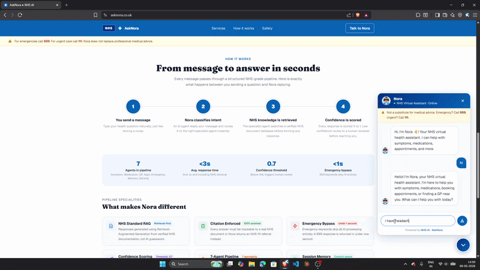

<div align="center">

<br />

<!-- Dynamic Banner -->


<br />

[](https://www.asknora.co.uk)
[](https://www.linkedin.com/feed/update/urn:li:activity:7455280820300247040/)
[](https://n8n.io)

<br />

<div align="center">
  
</div>

<br />

> **A production-grade NHS virtual health assistant powered by a multi-agent architecture. One webhook. One classifier. Seven specialist agents. Each doing exactly one job.**

<br />

</div>

---

## Table of Contents

- [Situation](#-situation)
- [Task](#-task)
- [How It Was Built](#-how-it-was-built)
- [Result](#-result)
- [Tech Stack](#-tech-stack)
- [Architecture](#-architecture)
- [Agent Breakdown](#-agent-breakdown)
- [Safety & Escalation Logic](#-safety--escalation-logic)
- [Screenshots](#-screenshots)
- [Limitations](#-limitations)
- [Future Scope](#-future-scope)
- [Links](#-links)

---

## 🔍 Situation

NHS patients often struggle to get timely answers to health queries, symptom concerns, or booking guidance outside of GP hours. Existing chatbot solutions tend to be either too generic or too rigid, failing to provide context-aware, safe, and trustworthy responses at scale.

The problem is not just technical. It is also a safety problem. A health assistant that gives a wrong medication tip or misses an emergency signal is worse than no assistant at all.

---

## 🎯 Task

Design and deploy a multi-agent NHS virtual health assistant that could:

- Accurately **classify patient intent** from a free-text message
- **Route** that message to the correct specialist agent
- Ensure **every response is grounded in verified NHS documentation**
- Flag **low-confidence outputs** to a human reviewer before reaching the patient
- Handle **emergencies** with a hardcoded, non-LLM response routing directly to 999

The system had to be safe-first, auditable, and production-ready without requiring a traditional engineering team.

---

## ⚙️ How It Was Built

Rather than writing a monolithic chatbot, the entire orchestration was built visually using **n8n** — wiring together agents, logic gates, and integrations in a fraction of the time traditional code would take.

### System Flow

```
Patient Message
      │
      ▼
  [ Webhook ]
      │
      ▼
[ Registration Agent ] ── collects name, phone, address
      │
      ▼
[ Classifier Agent ] ── LLaMA 3.3 70B
      │
      ├── EMERGENCY   → Emergency Handler (hardcoded, routes to 999)
      ├── SYMPTOM     → Symptom Checker (RAG via Supabase)
      ├── MEDICATION  → Medication Info Agent (RAG, no dosage)
      ├── APPOINTMENT → Appointment Assistance Agent
      ├── GP_FINDER   → GP Finder Agent (postcode → Maps link)
      ├── MEMORY      → Memory Agent (session recall)
      └── GENERAL     → General Health Agent
            │
            ▼
    [ Confidence Gate ]
      ├── < 0.7 → Gmail alert to team + holding message to patient
      └── ≥ 0.7 → Citation Validator → Response to Patient
                                    → Log to Google Sheets
```
> The full n8n workflow export and all agent system prompts are available in the [`workflow/`](./workflow/) and [`prompts/`](./prompts/) folders.

### Key Engineering Decisions

- **No vector hallucination allowed.** The RAG agents return "no result found" rather than generating a plausible-sounding but unverified answer.
- **Emergency responses are hardcoded**, not LLM-generated. No language model decides what to do when someone says "I can't breathe."
- **Confidence scoring on every response.** Below 0.7, a Gmail notification fires to the team. Above 0.7, a citation check validates the source before anything is sent.
- **Every interaction is logged** to Google Sheets for auditability and future clinician review.

---

## 📊 Result

| Metric | Outcome |
|---|---|
| Agents deployed | 7 specialist agents |
| Intent categories handled | EMERGENCY, SYMPTOM, MEDICATION, APPOINTMENT, GP_FINDER, MEMORY, GENERAL |
| Orchestration build time | ~2 hours in n8n |
| Safety gate | Confidence score < 0.7 triggers human-in-the-loop |
| Logging | Every interaction captured in Google Sheets |
| Live URL | [asknora.co.uk](https://www.asknora.co.uk) |

The orchestration, routing, confidence gating, HITL escalation, and citation validation took roughly two hours to wire in n8n. The hard work was in the **agent prompts and the safety logic**, not the plumbing.

---

## 🛠 Tech Stack

<div align="center">

| Layer | Technology |
|---|---|
| Orchestration |  |
| LLM Inference |  |
| Frontend |   |
| Database & RAG |   |
| Infrastructure |   |
| Alerting |  |
| Logging |  |

</div>

---

## 🏗 Architecture

```
┌─────────────────────────────────────────────────────────┐
│                    Patient (Browser)                    │
│                  asknora.co.uk (Next.js)                │
└───────────────────────┬─────────────────────────────────┘
                        │ HTTPS
                        ▼
┌─────────────────────────────────────────────────────────┐
│           n8n (Self-hosted, Hetzner VPS)                │
│         Exposed via Cloudflare Tunnel                   │
│                                                         │
│  Webhook → Classifier → Router → Specialist Agents      │
│                              ↓                          │
│                    Confidence Gate (0.7)                 │
│                    ↓              ↓                      │
│              Gmail Alert     Citation Check             │
│                              ↓                          │
│                        Google Sheets Log                │
└──────────────┬──────────────────────────────────────────┘
               │
               ▼
┌─────────────────────────────────────────────────────────┐
│              Supabase (PostgreSQL + pgvector)            │
│           NHS Documents stored as embeddings            │
└─────────────────────────────────────────────────────────┘
```

---

## 🤖 Agent Breakdown

### 1. Registration Agent
Collects the patient's name, phone number, and address before routing begins. Ensures every conversation is traceable and the team can always follow up.

### 2. Classifier Agent (LLaMA 3.3 70B via Groq)
Reads the incoming message and assigns one of seven intents. Acts as the traffic controller for the entire system.

### 3. Symptom Checker
RAG-grounded against NHS clinical documents stored in Supabase. If no matching vector result is found, the agent returns a safe fallback rather than generating an unverified answer.

### 4. Medication Info Agent
Same RAG discipline as the symptom checker. Never recommends dosage. Automatically flags responses involving high-risk patient groups.

### 5. Appointment Assistance Agent
Walks patients through NHS appointment booking step by step, with links to official booking pathways.

### 6. GP Finder Agent
Takes a patient postcode, returns a Google Maps link and the official NHS service search result for nearby GPs.

### 7. Memory Agent
Recalls what the patient said earlier in the same session, providing conversational continuity across the exchange.

### 8. Emergency Handler
Hardcoded response, not LLM-generated. Always routes to 999 first. No probabilistic model decides the outcome of an emergency.

---

## 🛡 Safety & Escalation Logic

```
Every response carries a confidence score
        │
        ├── Score < 0.7
        │       ├── Gmail alert fires to the team
        │       └── Patient receives a holding message
        │
        └── Score ≥ 0.7
                ├── Citation validator checks the source
                └── Response delivered to patient
```

All interactions, regardless of confidence score, are logged to Google Sheets for audit and clinician review.

---

## 📸 Screenshots

> Screenshots and demo GIFs from the live product at [asknora.co.uk](https://www.asknora.co.uk)

<!-- Replace the placeholder paths below with actual screenshots from your project -->

**Chat Interface** 👇🏼


<br>

**n8n Workflow Overview** 👇🏼


<br>

**Confidence Gate in Action** 👇🏼


<br>

**Google Sheets Audit Log** 👇🏼


---

## ⚠️ Limitations

| Limitation | Detail |
|---|---|
| Context window | Only 5 exchanges retained per session. Longer conversations lose early detail. |
| Booking integration | No direct NHS booking API yet. Guidance is step-by-step but not automated. |
| Language support | English only at this stage. |
| Registration friction | The upfront registration step can feel like a barrier if a patient is in distress. |

---

## 🚀 Future Scope

- **NHS API integration** for real-time appointment booking
- **Voice channel** via Twilio for patients who cannot type
- **Multi-language support** to serve a broader patient population
- **Clinician review dashboard** to replace the current Gmail alert system
- **Persistent memory** across sessions using a structured patient profile in Supabase

---

## 🔗 Links

| Resource | URL |
|---|---|
| Live Demo | [asknora.co.uk](https://www.asknora.co.uk) |
| LinkedIn Post | [Read the full breakdown](https://www.linkedin.com/feed/update/urn:li:activity:7455280820300247040/) |
| n8n | [n8n.io](https://n8n.io) |
| NHS Digital | [digital.nhs.uk](https://digital.nhs.uk) |

---

<div align="center">


*Built by [Rohit Kumar Dubey](https://www.linkedin.com/in/rohitkumardubey) · Feedback and contributions welcome*

</div>
